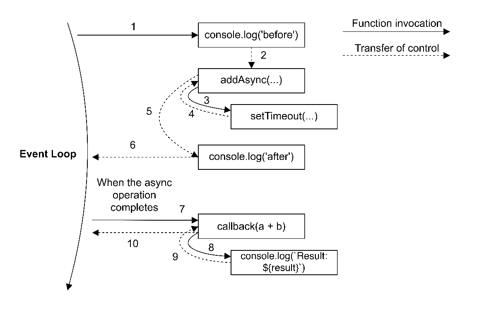

# Callbacks and Events

## The Callback pattern 回调模式

### The continuation-passing style 持续传递风格

- 传递返回结果
- 区别于direct style，direct style 是指使用return 返回结果

#### Synchronous CPS

#### Asynchronous CPS

```javascript
function additionAsync(a, b, callback) {
    setTimeout(() => callback(a + b), 100)
}
```

```javascript
console.log('before')
additionAsync(1, 2, result => console.log(`Result: ${result}`))
console.log('after')
```

```
before
after
Result: 3
```

执行 setTimeout 会立即返回，控制权会交给 additionAsync，然后交给它的调用者。 一旦异步请求发送，控制权会立刻交还给 event loop，从而允许处理事件队列中的新的事件。



#### Non-CPS callbacks

有些回调并不是CPS，比如map方法，传递的参数并不是执行的结果。

```javascript
const result = [1, 3, 5].map(element => element - 1)
console.log(result) // [0, 2, 4]
```

### Synchronous or asynchronous?

#### An unpredictable function

API 在某些情况下为同步，某些情况下为异步

```javascript
import {readFile} from 'fs'

const cache = new Map()

function inconsistentRead(filename, cb) {
    if (cache.has(filename)) {
        // invoke synchronously
        cb(cache.get(filename))
    } else {
        // asynchronous function
        readFile(filename, 'utf8', (err, data) => {
            cache.set(filename, data)
            cb(data)
        })
    }
}
```

#### Unleashing Zalgo

```javascript
function createFileReader(filename) {
    const listeners = []
    inconsistentRead(filename, value => {
        listeners.forEach(listener => listener(value))
    })
    return {
        onDataReady: listener => listeners.push(listener)
    }
}
```

当上述方法被调用时，它会创建一个新的通知者的对象，这个对象允许我们对文件读取操作设置一些监听器。 当读取操作完成并且数据可获取时，所有的监听器将被同时调用。 上述方法使用了 inconsistentRead() 方法。

```javascript
const reader1 = createFileReader('data.txt')
reader1.onDataReady(data => {
    console.log(`First call data: ${data}`)
    // sometime later we try to read again from the same file
    const reader2 = createFileReader('data.txt')
    reader2.onDataReady(data => {
        console.log(`Second call data: ${data}`)
    })
})
```

上述方法将会打印：

```
First Call data: some data
```

第二个reader的回调永远不会被触发：

- 在reader1的创建阶段，inconsistentRead() 中由于没有缓存，所以使用了异步的方法。 这就意味着任何 onDataReady 的监听器将会在其他的 event loop 中触发。 所以我们有足够的时间注册监听器。
- 然后，reader2 在缓存已经存在event loop 的循环中创建。 在这种情况下，内部的 inconsistentRead() 调用是同步的。 所以，它的回调是立即执行的，这就意味着reader2的监听也是同步执行的。
  然而，我们在reader2创建后注册了监听器，所以它永远不会执行。

***最主要的原因是，在代码中先调用了监听器，再执行的注册。***

#### Using synchronous APIs

同步的方法不一定要使用CPS，使用 direct style 就是最佳实践<br>
使用同步的API而不是异步会有一些警告：

- 某些方法可能没有同步的API
- 同步的API会阻塞 event loop，并会搁置任何并发请求。这会打破Node.js 的并发模型，降低整个应用的速度。

尽量不适用同步的API，但是某些情况下仍然适用，比如在项目初始化的过程中加载配置。

#### Guaranteeing asynchronicity with deferred execution 保证延迟执行的异步性

使用 process.nextTick() 方法让执行变为异步。 它的功能很简单：它接受一个回调作为一个参数，并且把它推到事件队列的顶端，在任何等待状态的 I/O 事件之前，然后立即返回。
然后当当前运行的操作将控制权带回事件循环时，将立即调用回调。

```javascript
import {readFile} from 'fs'

const cache = new Map()

function consistentReadAsync(filename, callback) {
    if (cache.has(filename)) {
        // deferred callback invocation
        process.nextTick(() => callback(cache.get(filename)))
    } else {
        // asynchronous function
        readFile(filename, 'utf8', (err, data) => {
            callback(data)
        })
    }
}
```

另一个延迟执行的 API 是 setImmediate()。 虽然它的目的与 process.nextTick() 很相似，但语义确完全不同。 通过 process.nextTick() 延迟的回调被称为 microtasks
微任务，并且当前操作完成后会立即执行，甚至在触发任何其他 I/O 事件之前。 另一方面，使用 setImmediate()，执行操作会在所有I/O事件处理完后的事件循环阶段排队。 因为 process.nextTick() 在任何已经计划的
I/O 事件之前运行，它会被更快的执行，但是在某些情况下，它也可能无限期的延迟任何 I/O回调的运行，例如在递归调用的情况下。 这在 setImmediate() 上永远不会发生。

setImmediate() 会比 setTimeout(callback, 0) 执行更快。 原因：我们必须考虑到 event loop 在不同的阶段执行所有的回调；对于我们正在考虑得类型，我们有计时器在I/O回调之前执行，而计时器又在
setImmediate() 回调之前执行。 这意味着，如果我们在setTimeout() 回调、I/O 回调或在这两个阶段后排队的微任务中排队使用 setImmediate() 的任务，那么回调将在我们当前所处的阶段之后的阶段执行。
setTimeout() 回调必须等待事件循环的下一周期。
***这段文字无法理解***

### Node.js callback conventions

#### The callback comes last

当一个方法接收一个回调作为参数，回调必须为最后一个参数。

```javascript
readFile(fileName, [options], callback)
```

#### Any error always comes first

在Node.js中，CPS函数产生的任何错误总是作为回调的第一个参数传递，任何实际结果都从第二个参数开始传递。 如果操作成果而没有错误，则第一个参数是null或undefined。

```javascript
readFile('foo.txt', 'utf8', (err, data) => {
    if (err) {
        handleError(err)
    } else {
        processData(data)
    }
})
```

每次都需要检查错误，方便debug。<br>
error的类型一定要是Error。

#### Propagating errors

在同步的direct style 的方法中通过throw 语句来传播error，这会导致错误在调用栈中跳升，直到被捕获。

在异步的CPS中，只需将错误传递给链中的下一个回调即可完成适当的错误传播。

```javascript
import {readFile} from 'fs'

function readJSON(filename, callback) {
    readFile(filename, 'utf8', (err, data) => {
        let parsed
        if (err) {
            // propagate the error and exit the current function
            return callback(err)
        }
        try {
            // parse the file contents
            parsed = JSON.parse(data)
        } catch (err) {
            return callback(err)
        }
        // no errors, propagate just data
        callback(null, parsed)
    })
}
```

我们在处理readFile() 的错误时并没有 throw 或者 return；相反，我们只是像使用其他结果一样使用回调。 而且，请注意我们如何使用try...catch 语句来捕获任何JSON.parse()
抛出的错误，一个同步的方法所以使用传统的 throw 指令来传播错误给调用者。最后，如果所有都正常，null 作为调用callback的第一个参数表示没有错误。

同样有趣的是，我们是如何避免在try代码块中调用回调的。这是因为这么做会捕获回调执行的所有错误，而这通常是我们不想要的。

#### Uncaught exceptions 未捕获异常

有时，在异步的回调中有可能会发生一个错误被抛出但是没有被捕获。例如我们没有在之前的readFile() 方法中使用try...catch 包裹 JSON.parse()。 在异步的回调中抛出错误将会导致错误跳升到event
loop，所以它永远不会被传播到下一个回调函数中。 在 Node.js 中，这是一个不可恢复的状态，并且程序会简单的用一个非零退出码退出，将堆栈跟踪打印到 stderr 接口。

```javascript
function readJSONThrows(filename, callback) {
    readFile(filename, 'utf8', (err, data) => {
        if (err) {
            return callback(err)
        }
        callback(null, JSON.parse(data))
    })
}
```

现在，在我们刚刚定义的方法中，没有办法捕获到来自JSON.parse()的最终异常。如果我们尝试解析一个无效的JSON文件：

```javascript
readJSONThrow('invalid_json.json', (err) => console.error(err))
```

这将会导致程序突然中止，一个类似于下方的堆栈追踪信息将会被打印到控制台：

```
SyntaxError: Unexpected token h in JSON at positon 1
    at JSON.parse (<anonymous>)
    at file:///.../03-callbacks-and-events/08-uncaught-errors/index.js:8:25
    at FSReqCallback.readFileAfterClose [as oncomplete] (internal/fs/read_file_context.js:61:3)
```

现在，如果你看到了上述的堆栈追踪，你将会发现它开始于从置的fs模块，并且正是从原生API读取完成并且通过event loop将其结果返回到fs.readFile()函数的点开始。
这清楚地展示了异常从我们的回调，上升到调用栈，并且直接到了最终捕获并抛出到控制台的event loop。

这也意味着用try...catch 包裹 readJSONThrows() 的调用将无效，因为该块操作的堆栈与调用回调的堆栈不同。 下面的代码展示了我们刚刚描述的反模式。

```javascript
try {
    readJSONThrows('invalid_json.json', (err) => console.error(err))
} catch (err) {
    console.log('This will NOT catch the JSON parsing exception')
}
```

上面的catch语句永远不会接收到JSON解析的错误，因为它将沿着引发错误的调用堆栈移动，即在event loop 中，而不是在触发异步操作的函数中。

正如之前提到的，程序将会在异常到达event loop时中止。然而，我们仍然有机会在程序停止前做一些清理和日志。 事实上，当这个发生时，Node.js 会触发一个特殊的事件称为 uncaughtException，就在退出进程之前。
下面是个代码示例：

```javascript
process.on('uncaughtException', (err) => {
    console.error(`This will catch at last the JSON parsing exception: ${err.message}`)
    // Terminates the application with 1 (error) as exit code.
    // Without the following line, the application would continue
    process.exit(1)
})
```

理解一个未捕获的异常会导致程序进入一个无法保证一致的状态是很重要的，这会导致不可预见的问题。 比如，可能有未完成的I/O请求还在运行，或者闭包可能变得不一致。 这就是为什么总是建议永远不要让程序在捕获未捕获的异常后继续运行，特别是生产环境。
相反，进程应该立即退出，也可以选择在运行一些必要的清理任务之后，理想情况下，管理进程应该重启程序。 这个也被称为fail-fast方法，在Node.js中也是推荐的做法。

## The Observer pattern

### The EventEmitter

### Creating and using the EventEmitter

### propagating errors

### Making any object observable

### EventEmitter and memory leaks

### Synchronous and asynchronous events

### EventEmitter versus callbacks

### Combining callbacks and events

## Summary

## Exercises
