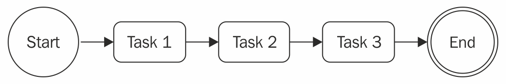

# Asynchronous Control Flow Patterns with Callbacks

- 异步编程的挑战。
- 避免回调地狱和其他回调的最佳实践。
- 常见的异步模式，如顺序执行、顺序迭代、并行执行和有限的并行执行。

## The difficulties of asynchronous programming

### Creating a simple web spider

### Callback hell

**pyramid of doom**

最明显的问题是可读性差。

另一个问题是在各个作用域中部分重叠的变量名。

闭包在表现和内存消耗上会带来一点代价。除此之外，他们也会造成很难识别的内存泄漏。
事实上，我们不应该忘记，活跃闭包引用的人也上下文都会从垃圾收集中保留。

## Callback best practices and control flow patterns

在这章，不仅会学到如何避免回调地狱，还有如何仅仅使用简单明了的JavaScript实现一些最常见的控制流模式。

### Callback discipline

当书写异步代码时，要记住的第一条规则是定义回调时，不要滥用就地函数定义。
这样做是很诱人的，因为它不需要思考一些额外的问题，比如模块化和重用性；不过，你已经理解了它的弊大于利。
大部分情况，解决回调地狱不需要任何库、花哨的技术或范式的改变；你只需要一些常识。

这些是一些基本原则，可以帮助我们保持低嵌套水平，并改善我们代码的整体组织：

- 尽早退出。根据上下文，用 `return` 、 `continue` 和 `break` 来立即退出当前的语句，而不是书写（嵌套）完整的 `if...else` 语句。
  这将有助于保持代码的浅显。
- 为回调函数命名，让他们远离闭包并且传递中间的结果作为参数。为函数命名也会让他们在堆栈追踪中看起来更好。
- 模块化代码。尽可能拆分代码到更小的、可重用的方法中。

### Applying the callback discipline

第一步，通过移除 `else` 语句来重构我们的错误检查模式。
这是通过在我们接收到错误后立即返回来实现的。因此，不要使用下面代码：

```javascript
if (err) {
  cb(err)
} else {
  // code to execute when there ar no errors
}
```

我们可以通过下面的写法改善代码组织：

```javascript
if (err) {
  return cb(err)
}
// code to execute when there are no errors
```

这就是经常被提到的尽早返回原则（ **early return principle**）。
通过这个简单的技巧，我们立即降低了函数的嵌套级别。这很简单，不需要任何复杂的重构。

**一个典型的错误是调用回调后忘记中止。对于错误处理的场景，下面的代码是典型的缺陷来源：**

```javascript
if (err) {
  callback(err)
}
// code to execute when there are no errors
```

永远不能忘记即使已经调用了回调，方法还是会继续执行。
之后插入 `return` 指令来阻断剩余函数的执行是很重要的。
而且，注意到函数的返回值是什么不重要，真正结果（或错误）是异步产生的，并且会出传递给回调。
异步函数的返回结果通常会被忽略。这个属性允许我们像下面这样编写快捷方式：

```javascript
return callback(...)
```

否则，我们不得不写出稍微详细的代码，比如：

```javascript
callback(...)
return
```

第二个针对 `spider()` 的优化是，我们可以尝试辨别可复用的代码片段。比如，将给定字符串写入到文件的功能可以很容易地分解为单独的函数，如下所示：

```javascript
function saveFile(filename, contents, cb) {
  mkdirp(path.dirname(filename), err => {
    if (err) {
      return cb(err)
    }
    fs.writeFile(filename, contents, cb)
  })
}
```

遵循同样的原则，我们可以创建一个普通的 `download()` 函数，他接收一个 URL 和一个文件名作为输入，并且下载 URL 到指定的文件。
内部可以使用我们之前定义的 `saveFile()` 函数：

```javascript
function download(url, filename, cb) {
  console.log(`Downloading ${url}`)
  superagent.get(url).end((err, res) => {
    if (err) {
      return cb(err)
    }
    saveFile(filename, res.text, err => {
      if (err) {
        return cb(err)
      }
      console.log(`Downloaded and saved: ${url}`)
      cb(null, filename, true)
    })
  })
}
```

最后一步，我们修改 `spider()` 函数，得益于我们的修改，它现在看起来像：

```javascript
export function spider(url, cb) {
  const filename = urlToFilename(url)
  fs.access(filename, err => {
    if (!err || err.code !== 'ENOENT') { // (1)
      return cb(null, filename, false)
    }
    download(url, filename, err => {
      if (err) {
        return cb(err)
      }
      cb(null, filename, true)
    })
  })
}
```

`spider()` 函数的功能和接口依然保持原样；发生变化的是组织代码的方式。
需要注意的一个重要的细节（1）是，我们颠倒了文件存在性的检查，以便我们可以遵循之前讨论的 early return 原则。

通过应用 early return 原则和其他回调规约原则，我们可以剧烈地减少我们代码的嵌套，并且同时，提高它的可复用性和可测试性。
事实上，我们可以考虑导出 `saveFile()` 和 `download()` ，以便我们可以在其他模块中复用他们。
这也将使我们能够测试他们作为独立的单元的功能。

我们在本节中进行的重构清楚地表明，大多数时候，我们只需要一些规约，以确保我们不会滥用闭包和匿名函数。
它效果显著，只需要最少的努力，也不需要外部库。

现在你已经知道如何通过回调编写简洁的异步代码，我们已经准备好探索一些最常见的异步模式，比如顺序或并行执行。

### Sequential execution

在本节中，我们查看异步控制流模式并且开始分析顺序执行流。

顺序执行一组任务意味着同一时间运行一个任务，一个接着一个。
执行顺序必须保留，因为列表中任务的结果也许会影响后续的执行。

这种流程有不同的变体：

- 顺序执行一组已知的任务，在他们之间不需要传播数据。
- 用一个任务的输出作为下一个任务的输入（也称为链式、管道或者瀑布流）。
- 在每个元素上一个接一个地运行异步任务时迭代集合。

顺序执行，尽管在使用direct风格阻断API是不微不足道的，但是在使用异步CPS时，通常是回调地狱的主要原因。

#### Executing a known set of tasks in sequence

在上一节中，我们已经在实现 `spider()` 函数的过程中查看了一个顺序执行。
通过应用一些简单的规则，我们能够组织顺序执行一组已知任务。
以该代码作为指南，我们现在可以用以下模式概括解决方案：

```javascript
function task1(cb) {
  asyncOperation(() => {
    task2(cb)
  })
}

function task2(cb) {
  asyncOperation(() => {
    task3(cb)
  })
}

function task3(cb) {
  asyncOperation(() => {
    cb() // finally executes the callback
  })
}

task1(() => {
  // executed when task1, task2, task3 aree completed
  console.log('task 1, 2 and 3 executed')
})
```

上面的模式显示了每个任务如何在完成通用异步操作时调用下一个任务。
该模式强调任务的模块化，显示了如何处理异步代码并不总是需要闭包。

### Sequential iteration

如果我们提前知道有多少任务将被执行，上节描述的模式表现完美。
这允许我们硬编码顺序中下个任务的调用，但是如果我们想要为集合中的每个项目执行一个异步任务会发生什么？
万一像这样，我们无法再硬编码任务顺序；相反，我们必须动态创建。

#### Web spider version 2

为了展示一个顺序迭代的例子，让我们引入一个新特性到 web spider 应用中。
我们现在想要递归下载一个网页中的所有链接。
为了做到这个，我们将从网页中摘出所有链接并且按顺序递归触发我们的 web spider。

第一步是修改我们的 `spider()` 函数，以便使用名为 `spiderLinks()` 的函数触发页面所有链接的递归下载，我们很快就会创建它。

此外，我们不会检查文件是否存在，而是尝试读取它并爬取它的链接。
这种方式，我们将能够恢复中断的下载。
最后一个修改，我们需要确保传播了一个新的参数 `nesting` ，它将帮我们限制递归的深度。代码如下：

```javascript
export function spider(url, nesting, cb) {
  const filename = urlToFilename(url)
  fs.readFile(filename, 'utf8', (err, fileContent) => {
    if (err) {
      if (err.code !== 'ENOENT') {
        return cb(err)
      }
      // the file doesn't exist, so let's download it
      return download(url, filename, (err, requestContent) => {
        if (err) {
          return cb(err)
        }
        spiderLinks(url, requestContent, nesting, cb)
      })
    }
    // The file already exists, let's process the links
    spiderLinks(url, fileContent, nesting, cb)
  })
}
```

在下一节，我们将探索如何实现 `spiderLinks()` 函数。

#### Sequential crawling of links

现在，我们可以创建这个版本的 web spider 应用的核心， `spiderLinks()` 函数，它使用顺序异步迭代算法下载一个HTML页面的所有链接。
请注意我们在接下来的代码块中定义他的方式：

```javascript
function spiderLinks(currentUrl, body, nesting, cb) {
  if (nesting === 0) {
    // Remember Zalgo from chapter 3?
    return process.nextTick(cb)
  }
  const links = getPageLinks(currentUrl, body)         // (1)
  if (links.length === 0) {
    return process.nextTick(cb)
  }

  function iterate(index) {                            // (2)
    if (index === links.length) {
      return cb()
    }
    spider(links[index], nesting - 1, function (err) { // (3)
      if (err) {
        return cb(err)
      }
      iterate(index + 1)
    })
  }

  iterate(0)                                           // (4)
}
```

这个新函数中的几个重要的步骤如下：

1. 我们使用 `getPageLinks()` 获取了这个页面中包含的所有链接的列表。
   这个函数返回了指向内部地址的链接（相同主机名）。
2. 我们用一个本地函数 `iterate()` 迭代链接，它接受下一个链接的 `index` 来分析。
   在这个方法中，我们做的第一件事情是检查 `index` 是否等于 `links` 数组的长度，
   在这种情况下我们立即调用 `cb()` 函数，因为这意味着我们已经处理了所有项目。
3. 这时，所有事情应该已经准备好来处理链接了。
   我们通过递减嵌套层级和在操作完成时调用下一步迭代来调用 `spider()` 函数。
4. 作为 `spiderLinks()` 函数的最后一步，我们通过调用 `iterate(0)` 来引导迭代器。

刚刚呈现的算法允许我们通过顺序执行异步操作来迭代数组，在我们的例子中是 `spider()` 函数。

最后，我们可以稍微修改我们的 `spider-cli` 以便我们可以指定嵌套层级作为一个附加的 CLI 参数：

```javascript
import {spider} from './spider.js'

const url = process.argv[2]
const nesting = Number.parseInt(process.argv[3], 10) || 1
spider(url, nesting, err => {
  if (err) {
    console.error(err)
    process.exit(1)
  }
  console.log('Download complete')
})
```

现在我们可以尝试这个新版本的蜘蛛程序并且观察它递归地下载一个网页的所有链接，一个接着一个。
为了打断进程，如果有很多链接，将会耗费一点时间，记住我们总是可以使用 Ctrl + C。
如果我们决定稍后恢复它，我们可以运行蜘蛛程序并且提供之前使用的URL。

_现在我们的网络蜘蛛应用程序可能会触发整个网站的下载，请考虑谨慎使用它。
例如，不要设置高嵌套层级，或让蜘蛛运行超过几秒钟。用数千个请求超载服务器是不礼貌的。
在某种情况下，这也可以被认为是非法的。蜘蛛负责任！_

#### The pattern

前一节中 `spiderLink()` 函数的代码是一个如何在应用异步操作时迭代一个集合成为可能的清晰的例子。
你也许注意到这是一个可以适用于其他任何在集合的元素上异步地迭代的情况的模式，通常来说，是一个任务的列表。
这种模式可以概括为如下：

```javascript
function iterate(index) {
  if (index === tasks.length) {
    return finish()
  }
  const task = task[index]
  task(() => iterate(index + 1))
}

function finish() {
  // iteration completed
}

iterate(0)
```

_重要的是要注意，如果 `task()` 是一个同步操作，这些类型的算法会变得非常递归。
在这种情况下，堆栈不会在每个周期中展开，并且可能会达到最大调用堆栈大小限制。_

我们刚刚呈现的模式非常强大，并且可以被扩展或调整以满足一些常见的需求。这里举几个例子：

- 我们可以异步地映射数组中的值
- 我们可以在迭代中传递一个操作的结果到下一个操作，来实现异步版本的 `reduce` 算法。
- 如果满足特定条件，我们可以过早退出循环（辅助函数 `Array.some()` 的异步实现）。
- 我们甚至可以迭代无限数量的元素。

我们甚至也可以选择通过用一个签名把它包裹进一个函数的方法来概括解决方案，如下：

```javascript
iterateSeries(collection, iteratorCallback, finalCallback)
```

这里， `collection` 是真正想要迭代的数据集， `iteratorCallback` 是每个项目执行的函数，
`finalCallback` 是当素有项目处理完成或出现错误时执行的函数。这个辅助函数的实现留给你作为练习。

_顺序迭代模式
通过创建一个名为 `iterator` 的函数顺序执行一组任务，
他执行集合中的下一个可获得的任务并且确保当前任务完成时执行下一步的迭代。_

在下一节，我们将探索并行执行模式，它在多个任务的顺序不重要时更加方便。

### Parallel execution

#### Web spider version 3

#### The pattern

#### Fixing race conditions with concurrent tasks

### Limited parallel execution

#### Limiting concurrency

#### Globally limiting concurrency

## The async library

## Summary

## Exercises
