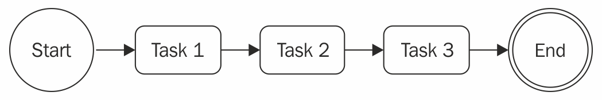
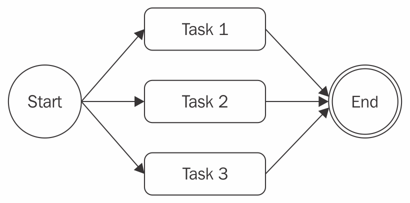
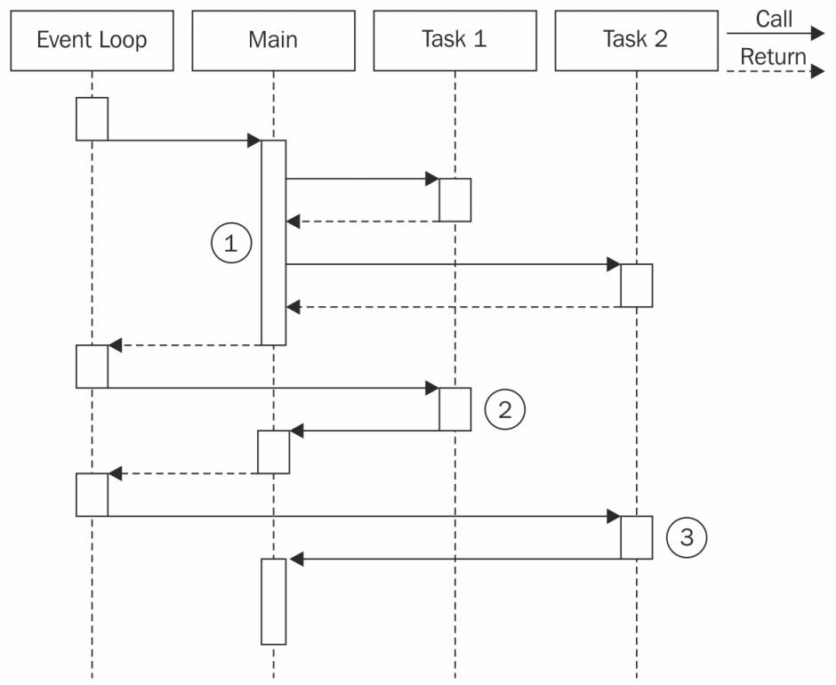
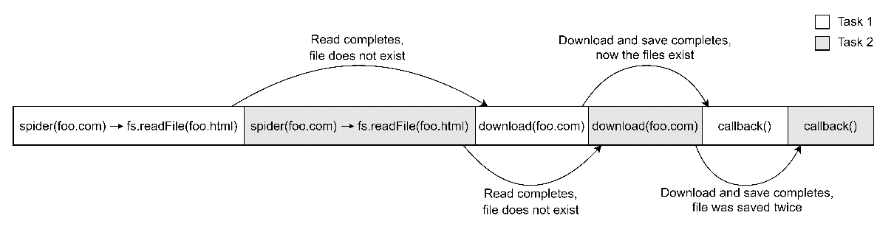
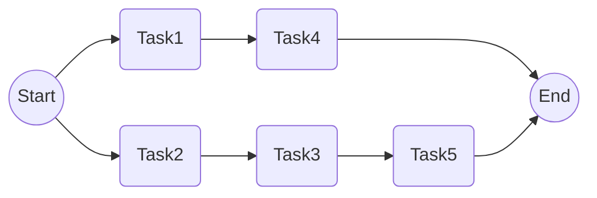

# Asynchronous Control Flow Patterns with Callbacks

- 异步编程的挑战。
- 避免回调地狱和其他回调的最佳实践。
- 常见的异步模式，如顺序执行、顺序迭代、并行执行和有限的并行执行。

## The difficulties of asynchronous programming

### Creating a simple web spider

### Callback hell

**pyramid of doom**

最明显的问题是可读性差。

另一个问题是在各个作用域中部分重叠的变量名。

闭包在表现和内存消耗上会带来一点代价。除此之外，他们也会造成很难识别的内存泄漏。
事实上，我们不应该忘记，活跃闭包引用的人也上下文都会从垃圾收集中保留。

## Callback best practices and control flow patterns

在这章，不仅会学到如何避免回调地狱，还有如何仅仅使用简单明了的JavaScript实现一些最常见的控制流模式。

### Callback discipline

当书写异步代码时，要记住的第一条规则是定义回调时，不要滥用就地函数定义。
这样做是很诱人的，因为它不需要思考一些额外的问题，比如模块化和重用性；不过，你已经理解了它的弊大于利。
大部分情况，解决回调地狱不需要任何库、花哨的技术或范式的改变；你只需要一些常识。

这些是一些基本原则，可以帮助我们保持低嵌套水平，并改善我们代码的整体组织：

- 尽早退出。根据上下文，用 `return` 、 `continue` 和 `break` 来立即退出当前的语句，而不是书写（嵌套）完整的 `if...else` 语句。
  这将有助于保持代码的浅显。
- 为回调函数命名，让他们远离闭包并且传递中间的结果作为参数。为函数命名也会让他们在堆栈追踪中看起来更好。
- 模块化代码。尽可能拆分代码到更小的、可重用的方法中。

### Applying the callback discipline

第一步，通过移除 `else` 语句来重构我们的错误检查模式。
这是通过在我们接收到错误后立即返回来实现的。因此，不要使用下面代码：

```javascript
if (err) {
  cb(err)
} else {
  // code to execute when there ar no errors
}
```

我们可以通过下面的写法改善代码组织：

```javascript
if (err) {
  return cb(err)
}
// code to execute when there are no errors
```

这就是经常被提到的尽早返回原则（ **early return principle**）。
通过这个简单的技巧，我们立即降低了函数的嵌套级别。这很简单，不需要任何复杂的重构。

**一个典型的错误是调用回调后忘记中止。对于错误处理的场景，下面的代码是典型的缺陷来源：**

```javascript
if (err) {
  callback(err)
}
// code to execute when there are no errors
```

永远不能忘记即使已经调用了回调，方法还是会继续执行。
之后插入 `return` 指令来阻断剩余函数的执行是很重要的。
而且，注意到函数的返回值是什么不重要，真正结果（或错误）是异步产生的，并且会出传递给回调。
异步函数的返回结果通常会被忽略。这个属性允许我们像下面这样编写快捷方式：

```javascript
return callback(...)
```

否则，我们不得不写出稍微详细的代码，比如：

```javascript
callback(...)
return
```

第二个针对 `spider()` 的优化是，我们可以尝试辨别可复用的代码片段。比如，将给定字符串写入到文件的功能可以很容易地分解为单独的函数，如下所示：

```javascript
function saveFile(filename, contents, cb) {
  mkdirp(path.dirname(filename), err => {
    if (err) {
      return cb(err)
    }
    fs.writeFile(filename, contents, cb)
  })
}
```

遵循同样的原则，我们可以创建一个普通的 `download()` 函数，他接收一个 URL 和一个文件名作为输入，并且下载 URL 到指定的文件。
内部可以使用我们之前定义的 `saveFile()` 函数：

```javascript
function download(url, filename, cb) {
  console.log(`Downloading ${url}`)
  superagent.get(url).end((err, res) => {
    if (err) {
      return cb(err)
    }
    saveFile(filename, res.text, err => {
      if (err) {
        return cb(err)
      }
      console.log(`Downloaded and saved: ${url}`)
      cb(null, filename, true)
    })
  })
}
```

最后一步，我们修改 `spider()` 函数，得益于我们的修改，它现在看起来像：

```javascript
export function spider(url, cb) {
  const filename = urlToFilename(url)
  fs.access(filename, err => {
    if (!err || err.code !== 'ENOENT') { // (1)
      return cb(null, filename, false)
    }
    download(url, filename, err => {
      if (err) {
        return cb(err)
      }
      cb(null, filename, true)
    })
  })
}
```

`spider()` 函数的功能和接口依然保持原样；发生变化的是组织代码的方式。
需要注意的一个重要的细节（1）是，我们颠倒了文件存在性的检查，以便我们可以遵循之前讨论的 early return 原则。

通过应用 early return 原则和其他回调规约原则，我们可以剧烈地减少我们代码的嵌套，并且同时，提高它的可复用性和可测试性。
事实上，我们可以考虑导出 `saveFile()` 和 `download()` ，以便我们可以在其他模块中复用他们。
这也将使我们能够测试他们作为独立的单元的功能。

我们在本节中进行的重构清楚地表明，大多数时候，我们只需要一些规约，以确保我们不会滥用闭包和匿名函数。
它效果显著，只需要最少的努力，也不需要外部库。

现在你已经知道如何通过回调编写简洁的异步代码，我们已经准备好探索一些最常见的异步模式，比如顺序或并行执行。

### Sequential execution

在本节中，我们查看异步控制流模式并且开始分析顺序执行流。

顺序执行一组任务意味着同一时间运行一个任务，一个接着一个。
执行顺序必须保留，因为列表中任务的结果也许会影响后续的执行。


这种流程有不同的变体：

- 顺序执行一组已知的任务，在他们之间不需要传播数据。
- 用一个任务的输出作为下一个任务的输入（也称为链式、管道或者瀑布流）。
- 在每个元素上一个接一个地运行异步任务时迭代集合。

顺序执行，尽管在使用direct风格阻塞API是微不足道的，但是在使用异步CPS时，通常是回调地狱的主要原因。

#### Executing a known set of tasks in sequence

在上一节中，我们已经在实现 `spider()` 函数的过程中查看了一个顺序执行。
通过应用一些简单的规则，我们能够组织顺序执行一组已知任务。
以该代码作为指南，我们现在可以用以下模式概括解决方案：

```javascript
function task1(cb) {
  asyncOperation(() => {
    task2(cb)
  })
}

function task2(cb) {
  asyncOperation(() => {
    task3(cb)
  })
}

function task3(cb) {
  asyncOperation(() => {
    cb() // finally executes the callback
  })
}

task1(() => {
  // executed when task1, task2, task3 aree completed
  console.log('task 1, 2 and 3 executed')
})
```

上面的模式显示了每个任务如何在完成通用异步操作时调用下一个任务。
该模式强调任务的模块化，显示了如何处理异步代码并不总是需要闭包。

### Sequential iteration

如果我们提前知道有多少任务将被执行，上节描述的模式表现完美。
这允许我们硬编码顺序中下个任务的调用，但是如果我们想要为集合中的每个项目执行一个异步任务会发生什么？
万一像这样，我们无法再硬编码任务顺序；相反，我们必须动态创建。

#### Web spider version 2

为了展示一个顺序迭代的例子，让我们引入一个新特性到 web spider 应用中。
我们现在想要递归下载一个网页中的所有链接。
为了做到这个，我们将从网页中摘出所有链接并且按顺序递归触发我们的 web spider。

第一步是修改我们的 `spider()` 函数，以便使用名为 `spiderLinks()` 的函数触发页面所有链接的递归下载，我们很快就会创建它。

此外，我们不会检查文件是否存在，而是尝试读取它并爬取它的链接。
这种方式，我们将能够恢复中断的下载。
最后一个修改，我们需要确保传播了一个新的参数 `nesting` ，它将帮我们限制递归的深度。代码如下：

```javascript
export function spider(url, nesting, cb) {
  const filename = urlToFilename(url)
  fs.readFile(filename, 'utf8', (err, fileContent) => {
    if (err) {
      if (err.code !== 'ENOENT') {
        return cb(err)
      }
      // the file doesn't exist, so let's download it
      return download(url, filename, (err, requestContent) => {
        if (err) {
          return cb(err)
        }
        spiderLinks(url, requestContent, nesting, cb)
      })
    }
    // The file already exists, let's process the links
    spiderLinks(url, fileContent, nesting, cb)
  })
}
```

在下一节，我们将探索如何实现 `spiderLinks()` 函数。

#### Sequential crawling of links

现在，我们可以创建这个版本的 web spider 应用的核心， `spiderLinks()` 函数，它使用顺序异步迭代算法下载一个HTML页面的所有链接。
请注意我们在接下来的代码块中定义他的方式：

```javascript
function spiderLinks(currentUrl, body, nesting, cb) {
  if (nesting === 0) {
    // Remember Zalgo from chapter 3?
    return process.nextTick(cb)
  }
  const links = getPageLinks(currentUrl, body)         // (1)
  if (links.length === 0) {
    return process.nextTick(cb)
  }

  function iterate(index) {                            // (2)
    if (index === links.length) {
      return cb()
    }
    spider(links[index], nesting - 1, function (err) { // (3)
      if (err) {
        return cb(err)
      }
      iterate(index + 1)
    })
  }

  iterate(0)                                           // (4)
}
```

这个新函数中的几个重要的步骤如下：

1. 我们使用 `getPageLinks()` 获取了这个页面中包含的所有链接的列表。
   这个函数返回了指向内部地址的链接（相同主机名）。
2. 我们用一个本地函数 `iterate()` 迭代链接，它接受下一个链接的 `index` 来分析。
   在这个方法中，我们做的第一件事情是检查 `index` 是否等于 `links` 数组的长度，
   在这种情况下我们立即调用 `cb()` 函数，因为这意味着我们已经处理了所有项目。
3. 这时，所有事情应该已经准备好来处理链接了。
   我们通过递减嵌套层级和在操作完成时调用下一步迭代来调用 `spider()` 函数。
4. 作为 `spiderLinks()` 函数的最后一步，我们通过调用 `iterate(0)` 来引导迭代器。

刚刚呈现的算法允许我们通过顺序执行异步操作来迭代数组，在我们的例子中是 `spider()` 函数。

最后，我们可以稍微修改我们的 `spider-cli` 以便我们可以指定嵌套层级作为一个附加的 CLI 参数：

```javascript
import {spider} from './spider.js'

const url = process.argv[2]
const nesting = Number.parseInt(process.argv[3], 10) || 1
spider(url, nesting, err => {
  if (err) {
    console.error(err)
    process.exit(1)
  }
  console.log('Download complete')
})
```

现在我们可以尝试这个新版本的蜘蛛程序并且观察它递归地下载一个网页的所有链接，一个接着一个。
为了打断进程，如果有很多链接，将会耗费一点时间，记住我们总是可以使用 Ctrl + C。
如果我们决定稍后恢复它，我们可以运行蜘蛛程序并且提供之前使用的URL。

_现在我们的网络蜘蛛应用程序可能会触发整个网站的下载，请考虑谨慎使用它。
例如，不要设置高嵌套层级，或让蜘蛛运行超过几秒钟。用数千个请求超载服务器是不礼貌的。
在某种情况下，这也可以被认为是非法的。蜘蛛负责任！_

#### The pattern

前一节中 `spiderLink()` 函数的代码是一个如何在应用异步操作时迭代一个集合成为可能的清晰的例子。
你也许注意到这是一个可以适用于其他任何在集合的元素上异步地迭代的情况的模式，通常来说，是一个任务的列表。
这种模式可以概括为如下：

```javascript
function iterate(index) {
  if (index === tasks.length) {
    return finish()
  }
  const task = task[index]
  task(() => iterate(index + 1))
}

function finish() {
  // iteration completed
}

iterate(0)
```

_重要的是要注意，如果 `task()` 是一个同步操作，这些类型的算法会变得非常递归。
在这种情况下，堆栈不会在每个周期中展开，并且可能会达到最大调用堆栈大小限制。_

我们刚刚呈现的模式非常强大，并且可以被扩展或调整以满足一些常见的需求。这里举几个例子：

- 我们可以异步地映射数组中的值
- 我们可以在迭代中传递一个操作的结果到下一个操作，来实现异步版本的 `reduce` 算法。
- 如果满足特定条件，我们可以过早退出循环（辅助函数 `Array.some()` 的异步实现）。
- 我们甚至可以迭代无限数量的元素。

我们甚至也可以选择通过用一个签名把它包裹进一个函数的方法来概括解决方案，如下：

```javascript
iterateSeries(collection, iteratorCallback, finalCallback)
```

这里， `collection` 是真正想要迭代的数据集， `iteratorCallback` 是每个项目执行的函数，
`finalCallback` 是当素有项目处理完成或出现错误时执行的函数。这个辅助函数的实现留给你作为练习。

_顺序迭代模式
通过创建一个名为 `iterator` 的函数顺序执行一组任务，
他执行集合中的下一个可获得的任务并且确保当前任务完成时执行下一步的迭代。_

在下一节，我们将探索并行执行模式，它在多个任务的顺序不重要时更加方便。

### Parallel execution

有些情况下顺序不重要，我们只是想在所有任务完成时被通知到。这种情况用并行执行模式会更好。


这可能听起来很奇怪，如果你考虑到 Node.js 是单线程的话，
但是如果你记得我们在 _Chapter 1, The Node.js Platform_ 中讨论的内容的话，
你会意识到即使只有一个线程，我们也可以实现并发，这得益于 Node.js 的非阻塞特性。
事实上，并行这个词在这种情况并不合适，因为它并不意味着任务同时运行，而是由底层的、
非阻塞API和事件循环的交错来执行的。

正如你所知道的，当一个任务的请求一个新的异步操作时会把控制权交还给事件循环，
从而允许事件循环执行另一个任务。用于这种流的正确词汇是并发，但是为了简单起见，我们仍然会使用并行。

下图展示了两个异步任务在 Node.js 平台上是如何并行运行的。



在图中，我们有个**Main**函数执行两个异步任务：

1. **Main**函数触发了**Task1**和**Task2**的执行。
   由于他们触发了一个异步操作，他们立即把控制权返还给了**Main**函数，**Main**函数之后又把控制权返还给了事件循环。
2. 当**Task1**的异步操作完成时，事件循环把控制权给了它。
   当它也完成了内部的同步处理后，会通知**Main**函数。
3. 当由**Task2**触发的异步操作完成时，事件循环调用它的回调，把控制权交还给**Task2**。
   在**Task2**的最后，**Main**函数又一次被通知。
   这时，**Main**函数知道**Task1**和**Task2**都已经完成，所以它可以继续执行或者返回操作的结果到其他回调。

简单的来说，这意味在 Node.js 中，我们只可以并行处理异步操作，因为他们的并发是由内部的非阻塞API处理的。
在 Node.js 里，同步（阻塞）操作无法并发运行，除非他们的执行与一个异步操作交替，或者与 `setTimeout()` 或 `setImmediate()` 交替。
你会在*Chapter 11, Advanced Recipes*中看到更多细节。

#### Web spider version 3

我们的网络蜘蛛程序看起来是并行执行概念的完美候选人。
目前为止，我们的应用程序以顺序的方式递归下载链接的网页。
我们可以通过并行下载所有链接的网页的方式轻易地优化处理的性能。

为此，我们只需要修改 `spiderLinks()` 函数来确保一次性生成所有的 `spider()` 任务，
然后仅在所有任务都完成执行时调用最终回调。所以，让我们像下面这样修改 `spiderLinks()` ：

```javascript
function spiderLinks(currentUrl, body, nesting, cb) {
  if (nesting === 0) {
    return process.nextTick(cb)
  }
  const links = getPageLinks(currentUrl, body)
  if (links.length === 0) {
    return process.nextTick(cb)
  }
  let completed = 0
  let hasErrors = false

  function done(err) {
    if (err) {
      hasErrors = true
      return cb(err)
    }
    if (++completed === links.length && !hasErrors) {
      return cb()
    }
  }

  links.forEach(link => spider(link, nesting - 1, done))
}
```

让我们讨论下修改了什么。正如之前提到的，现在所有 `spider()` 任务一次性全部开始。
对 `links` 数组简单的迭代和直接开始每个任务而无需等待前一个任务完成使这成为可能：

```javascript
links.forEach(link => spider(link, nesting - 1, done))
```

然后，让我们的应用等待所有任务完成的技巧是提供给 `spider()` 函数一个特殊的回调，我们称它为 `done()`。
`done()` 函数在一个 `spider` 任务完成时会递增一个计数器。
当完成的下载数到达 `links` 数组的长度，最终回调被调用：

```javascript
function done(err) {
  if (err) {
    hasErrors = true
    return cb(err)
  }
  if (++completed === links.length && !hasErrors) {
    return cb()
  }
}
```

> `hasErrors` 变量是必须的，因为如果一个并行任务失败了，我们希望立即调用具有给定错误的回调。
> 而且，我们需要确保其他可能正在运行的并行任务不会再次调用回调。

有了这些更改，如果我们现在尝试对网页运行蜘蛛程序，我们将注意到整个过程的速度有了巨大提升，
因为每次下载都将并行进行，而无需等待处理上一个链接。

#### The pattern

最后，我们可以为并行执行流提取我们漂亮的小模式。让我们用以下代码呈现模式的通用版本：

```javascript
const tasks = [/*...*/]
let completed = 0
task.forEach(task => {
  task(() => {
    if (++completed === tasks.length) {
      finish()
    }
  })
})

function finish() {
  // all the tasks completed
}
```

通过小小的改动，我们可以调整模式，将每个任务的结果累积到一个集合中，过滤或映射数组的元素，或者在
一个或给定数量的任务完成后立即调用 `finfish()` 回调（特别是最后一种情况被称为竞争）。

> **无限制并行执行模式**
>
> 通过一次性启动所有异步任务来并行运行一组异步任务，然后通过计数其回调的调用次数来等待这些所有任务都完成。

当我们有很多任务并行执行时，我们有可能会遇到竞争的情况，即争用以访问外部资源（录入，数据库中的文件或记录）。
在下一节中，我们将讨论 Node.js 的竞争条件并探索一些识别和解决他们的技术。

#### Fixing race conditions with concurrent tasks

在多线程与阻塞 I/O 结合使用时，并行运行一组任务可能会导致问题。
但是，您刚刚看到，在 Node.js 中，这是一个完全不同的故事。
并行运行多个异步任务在资源方面即简单又便宜。

这是 Node.js 的最重要的优势之一，因为它让并行成为一种常见的做法，而不是在绝对必要情况时使用的复杂技术。

Node.js 并发模型的另一个重要特性是我们处理任务同步和竞争条件的方式。
在多线程编程中，这通常是使用锁、互斥锁、信号量和监视器等构造完成的，它可能是并行化最复杂的方面之一，并且对性能有相当大的影响。
在 Node.js 中，我们通常不需要花哨的同步机制，因为所有内容都在单个线程上运行。
但是，这并不意味着我们不能有竞争条件;相反，它们可能很常见。
问题的根源是异步操作的调用与其结果的通知之间的延迟。

为了看到一个具体的例子，我们将再次参考我们的网络蜘蛛应用，特别是我们创建的最后一个版本，它实际上包含一个竞争条件（你能发现它吗？）。
我们正在讨论的问题在于 `spider()` 函数，在开始下载相应的URL之前，我们会检查文件是否存在：

```javascript
export function spider(url, nesting, cb) {
  const filename = urlToFilename(url)
  fs.readFile(filename, 'utf8', (err, fileContent) => {
    if (err) {
      if (err.code !== 'ENOENT') {
        return cb(err)
      }
      return download(url, filename, (err, requestContent) => {

// ...
```

问题在于，在两个任务中的一个完成了下载并创建了文件之前，在同一个URL上的两个 `spider` 任务可能对同一个文件调用 `fs.readFile()`。
从而导致两个任务都开始下载。图 4.4 说明了这种情况：



图4.4显示出 **Task 1** 和 **Task 2** 是在 Node.js 的单线程中如何交替的，以及异步操作如何实际引入竞争条件。
在我们的例子中，两个 `spider` 任务最终下载了相同的文件。

我们如何修复它？答案要比你想的简单很多。
事实上，我们所需要的只是一个变量，用于相互排除在同一个URL上运行的多个 `spider()` 任务。
这可以通过一些代码来实现，如下所示：

```javascript
const spidering = new Set()

function spider(url, nesting, cb) {
  if (spidering.has(url)) {
    return process.nextTick(cb)
  }
  spidering.add(url)
  // ...
}
```

这个修复不需要太多的注释。
如果给定的 `url` 已经在 `spidering` 集合中，我们只需立即退出函数；否则，我们添加 `url` 到集合后继续下载。
在我们的例子中，不需要解锁，因为我们不关心下载一个 URL 两次，即使在两个完全不同的时间点执行`spider` 任务。
如果你正在构建一个可能需要下载数十万网页的蜘蛛程序，在文件下载完成时移除集合中已下载的 `url`能帮助保持集合的基数，
从而防止无限增长的内存消耗。

竞争条件会引发很多问题，即使我们在单线程环境中。
在一些情况下，他们可能导致数据损坏并且由于其短暂性通常很难调试。
因此，在并行运行任务时仔细检查这些类型的情况总是很好的做法。

而且，运行任意数量的并行任务可能是一个危险的行为。
在下节中，你将会发现为什么它会成为一个问题，以及如何控制并行任务的数量。

### Limited parallel execution

在没有限制的情况下生成并行任务通常会导致负载过大。=。
想象一下并行运行上千个读取文件、访问URL或数据库查询。
这种情况下一个常见的问题是资源不足。
最常见的例子是，当一个应用尝试一次性打开太多文件时，利用了所有进程可用的文件描述符。

一个生成无限制的并行任务来处理用户请求的服务可能被拒绝服务（DoS）攻击所利用。
也就是说，恶意行为者可以伪造一个或多个请求来推动服务器消耗所有可用资源并变得无响应。
通常，限制并行任务的数量是一种有助于构建可复原应用程序的良好做法。

我们的第三版本蜘蛛程序没有限制并行任务数，所以在很多情况下很容易崩溃。
比如，如果我么尝试针对一个非常大的网站运行它，我们可能会看到它运行几秒，然后失败，错误代码为 `ECONNREFUSED`。
当我们从web服务器同时下载太多页面时，服务器将会决定开始拒绝来自同一IP的新链接。
在这种情况下，我们的蜘蛛程序会崩溃，如果我们想继续抓取网站，我们将不得不重启该过程。
我们可以只处理 `ECONNREFUSED` 来阻止进程崩溃，但是我们仍然冒着分配太多并行任务的风险，并可能会遇到其他问题。

在本节中，我们将看到如何通过限制并行任务的数量来使爬虫程序更加健壮。

下图展示了五项任务如何在并发上限为2的流程中执行：



图4.5：举例说明如何把平行执行的最大任务数设为两项

从图4.5中可以清楚地看到算法的运作方式：

1. 一开始，我们尽可能多的开启一些任务，而不超过并发上线。
2. 然后，每次任务完成，我们开启一个或多个任务，直到再次达到任务上线。

下一节，我们探索受限的平行执行模式的实现可能性。

#### Limiting concurrency

我们现在来看一个模式，平行执行一批任务，并且让同时运行的任务数不超过上限：

```javascript
const tasks = [
  // ...
]
const concurrency = 2
let running = 0
let completed = 0
let index = 0

function next() {  // (1)
  while (running < concurrency && index < tasks.length) {
    const task = tasks[index++]
    task(() => {   // (2)
      if (++completed === tasks.length) {
        return finish()
      }
      running--
      next()
    })
    running++
  }
}

next()

function finish() {
  // 所有任务都已完成
}
```

这个算法可以考虑成顺序执行和平行执行的混合模式。
事实上，你可能会注意到与这两种模式的共同点：

1. 我们有一个迭代函数，名为 `next()` ，然后一个内部的循环在并发限制内发起了尽可能多的任务。
2. 下一个重要的部分是我们传给每个任务的回调，
   它检查了我们是否完成了所有列表中的任务。如果仍然有任务将被运行，它调用 `next()` 来发起另一些任务。

_**这里使用了while，而不是if，为了在第一次调用时同时开启多个任务，后续调用时，应该最多只能开启一个新任务**_

很简单，对吧？

#### Globally limiting concurrency

我们的网页爬虫程序非常适合使用刚刚学到的，限制并发的数量。
事实上，为了避免同时对数千个链接进行爬取的情况，我们可以通过添加一些关于并发下载数的可预测性，来强制限制此过程的并发性。

我们可以将受限并发模式的这种实现应用于我们的 `spider()` 函数，但是通过这样做，我们只能限制从给定页面中找到的链接生成的并发任务。
例如，如果我们选择两个并发，每个页面只能最多平行下载两个链接。
但是，由于我们可以同时下载多个链接，每个网页又发起另外两个下载，导致下载操作的总和呈指数级增长。

通常来说，当我们有一组总数固定的任务，或者任务集合随着时间线性增长的时候，这种受限并行模式的实现效果非常好。
相反，当一个任务可以直接生成两个或多个任务的时候，就像发生在我们的爬虫程序一样，这种实现不适合限制全局的并发性。

##### Queues to the rescue

我们真正想要的是，限制全局的并行下载操作数。
我们可以稍微修改上一节中显示的模式，但这留给你作为一个练习。
相反，让我们讨论另一个机制，利用 `queues` 限制多任务的并发性。让我们来看看它是如何运作的。

我们现在将要实现一个简单的 class 名为 `TaskQueue` ，它结合了队列和刚刚讨论受限并发时的所呈现的算法。
让我们创建一个名为 `taskQueue.js` 的模块：

```javascript
export class TaskQueue {
  constructor(concurrency) {
    this.concurrency = concurrency
    this.running = 0
    this.queue = []
  }

  pushTask(task) {
    this.queue.push(task)
    process.nextTick(this.next.bind(this))
    return this
  }

  next() {
    while (this.running < this.concurrency && this.queue.length) {
      const task = this.queue.shift()
      task(() => {
        this.running--
        process.nextTick(this.next.bind(this))
      })
      this.running++
    }
  }
}
```

这个类的构造器只接受并发的限制数，另外，初始化了变量 `running` 和 `queue`。
前者是一个计数器，用来追踪所有正在运行的任务，
而后者是一个数组，用来存储所有pending状态的任务。

`pushTask()` 方法简单地添加任务到queue中，然后通过异步调用 `this.next()` 来引导工作线程执行。
注意到我们必须使用 `bind` ，因为如果不这样的话，当 `next` 函数被 `process.nextTick` 调用时会丢失上下文。

`next()` 方法发起了队列中的一套任务，保证并发数不会超过限制。

你可能注意到这个方法与 *Limiting concurrency* 一节中呈现的模式有些相似。
他实际上在不超出并行限制的前提下开启了尽可能多的任务。
当每个任务完成时，它更新了正在运行的任务的计数，并且通过再次异步调用 `next()` 调用开启了另一轮的任务。
`TaskQueue` 类的一个有趣的属性是，它允许我们动态添加任务到队列中。
另一个优点是，现在，我们有一个中央实体负责限制任务的并发，这些任务可以在函数执行的所有实例间共享。
在我们的例子中，它是 `spider()` 函数，正如您稍后将看到的。

##### Refining the TaskQueue

前面对 `TaskQueue` 的实现是一个队列模型充分的例子，
但是为了在实际项目中使用，它需要一些额外的特性。
比如，当其中一个任务失败了，我们如何告知程序？
我们如何知道所有队列中的任务已经完成？

让我们带回一些在第三章 `Callbacks and Events` 中讨论的概念，
然后一起吧 `TaskQueue` 转变为 `EventEmitter` ，以便我们可以触发事件来传播任务的失败和在队列已经为空时通知所有观察者。

第一个改变是引入 `EventEmitter` 类，然后让 `TaskQueue` 继承它：

```javascript
import {EventEmitter} from 'events'

export class TaskQueue extends EventEmitter {
  constructor(concurrency) {
    super()
    // ...
  }

  // ...
}
```

现在，我们可以使用 `this.emit` 从 `TaskQueue` `next()` 方法中触发事件：

```javascript
next()
{
  if (this.running === 0 && this.queue.length === 0) { // (1)
    return this.emit('empty')
  }
  while (this.running < this.concurrency && this.queue.length) {
    const task = this.queue.shift()
    task((err) => {                                   // (2)
      if (err) {
        this.emit('error', err)
      }
      this.runing--
      process.nextTick(this.next.bind(this))
    })
    this.running++
  }
}
```

与之前相比，有两处新增的内容：

- 每次 `next()` 函数被调用，我们检查是否没有正在运行的任务和队列是否为空。
  这种情况下，意味着队列已经为空并且我们可以发出 `empty` 事件。
- 每个任务的完成回调现在可以通过传递错误来调用。我们检查错误是否真的被传递，
  表明任务已经失败，并且在这种情况下，我们用 `error` 事件传播错误。

请注意，如果出现错误，我们有意让队列保持运行。
我们没有停止其他进程中的任务，也没有移除任何等待状态的任务。
这在基于队列的系统中很常见。
预计会发生错误，而不是让系统在这些情况下崩溃，通常较好的做法是区分错误并且思考重试或恢复的策略。
我们将在13章 `Messageing and Integration patterns` 更多的讨论这些概念。

##### Web spider version 4

既然我们已经有一个通用的队列，可以在受限的平行工作流中执行任务，那就直接使用它来重构我们的爬虫程序。

我们将使用一个 `TaskQueue` 的实例作为堆积工作任务的地方，每个我们想爬取的URL都会作为一个任务被添加到队列中。
开始的 URL 将会被添加为第一个任务，然后所有在爬取过程中发现的URL也会被添加。
队列将会帮助我们管理，
并且确保进程中的任何时间的任务数（正在下载的页面数或文件系统的读操作数）永远不会多于 `TaskQueue` 实例配置的限制数。

我们已经在 `spider()` 函数中定义了爬取一个给定URL的逻辑。
现在可以考虑将它变为通用的爬取任务。
为了更清楚的说明，最好的方式是重命名它为 `spiderTask` ：

```javascript
function spiderTask(url, nesting, queue, cb) { // (1)
  const filename = urlToFilename(url)
  fs.readFile(filename, 'utf8', (err, fileContent) => {
    if (err) {
      if (err.code !== 'ENOENT') {
        return cb(err)
      }
      return download(url, filename, (err, requestContent) => {
        if (err) {
          return cb(err)
        }
        spiderLinks(url, requestContent, nesting, queue) // (2)
        return cb()
      })
    }
    spiderLinks(url, fileContent, nesting, queue) // (3)
    return cb()
  })
}
```

除了重命名了函数，你可能也注意到我们应用了一些小的变更：

- 函数注册现在接受一个新的参数 `queue` 。它是一个 `TaskQueue` 的实例，我们需要携带它来让他可以在必要的时候添加新任务。
- 负责添加新爬取链接的是 `spiderLinks` 函数，所以我们需要在下载完一个页面后调用这个函数的时候，确保传递队列实例。
- 在一个已被下载过的文件中调用 `spiderLinks` 时，也需要传递队列实例。

让我们重新看一下 `spiderLinks()` 函数。
由于它不再需要追踪任务的完成，现在可以极大的被简化，因为这个任务交给了队列。
它现在执行的实际上是同步操作，它只需要调用新的 `spider()` 函数（即将要定义的）来将任务添加到队列中，针对每个被发现的链接。

```javascript
function spiderLinks(currentUrl, body, nesting, queue) {
  if (nesting === 0) {
    return
  }
  const links = getPageLinks(currentUrl, body)
  if (links.length === 0) {
    return
  }
  links.forEach(link => spider(link, nesting - 1, queue))
}
```

现在重新看一下 `spider()` 函数，它需要充当第一个URL的入口点，它也会被用来添加每个新URL到队列中：

```javascript
const spidering = new Set() // (1)
export function spider(url, nesting, queue) {
  if (spidering.has(url)) {
    return
  }
  spidering.add(url)
  queue.pushTask((done) => { // (2)
    spiderTask(url, nesting, queue, done)
  })
}
```

正如你所看到的，这个函数现在有两个主要的职责：

1. 它通过 `spidering` 这个集合，来记录已经访问过或正在处理的URL。
2. 它添加新的任务到 `queue`。一旦完成，这个任务会调用 `spiderTask()` 函数，有效地开启指定URL的爬取。

最后，我们可以更新 `spider-cli.js` 脚本，它允许我们从命令行调用爬虫程序：

```javascript
import {spider} from './spider.js'
import {TaskQueue}

form
'./TaskQueue.js'
const url = process.argv[2]                                      // (1)
const nesting = Number.parseInt(process.argv[3], 10) || 1
cosnt
concurrency = Number.parseInt(process.argv[4], 10) || 2
const spiderQueue = new TaskQueue(concurrency)                   // (2)
spiderQueue.on('error', console.err)
spiderQueue.on('empty', () => console.log('Download complete'))
spider(url, nesting, spiderQueue)                                // (3)
```

这个脚本现在由三个主要部分组成：

1. CLI 参数解析。请注意脚本现在接受的第三个参数，它可以用来自定义并行的层级。
2. 一个 `TaskQueue` 对象被创建，并且监听器附加到 `error` 和 `empty` 事件上。
   当发生错误，我们简单的打印他。当队列为空，这也意味着我们完成了网站的爬取。
3. 最后，我们通过调用 `spider` 函数，开始爬取过程。

应用这些更改后，我们可以尝试再一次运行爬虫模块。当我们运行如下命令：

```
node spider-cli.js https://loige.co 1 4
```

我们可以注意到在同一时间不会再有超过4个下载。

通过最后一个例子，我们可以概括基于回调的模式。
在下一节中，我们会看到一个流行库，它提供了这些模式和许多其他异步工具的可用于生产环境的实现。

## The async library

## Summary

## Exercises
