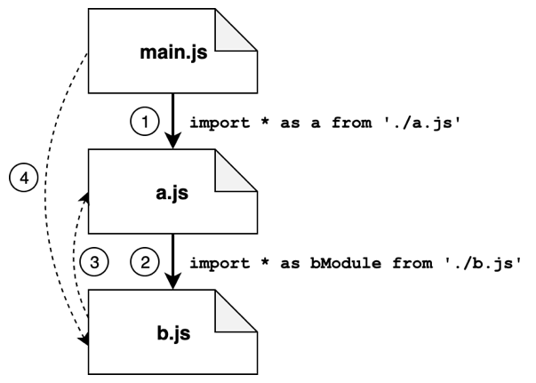
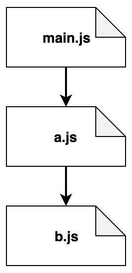
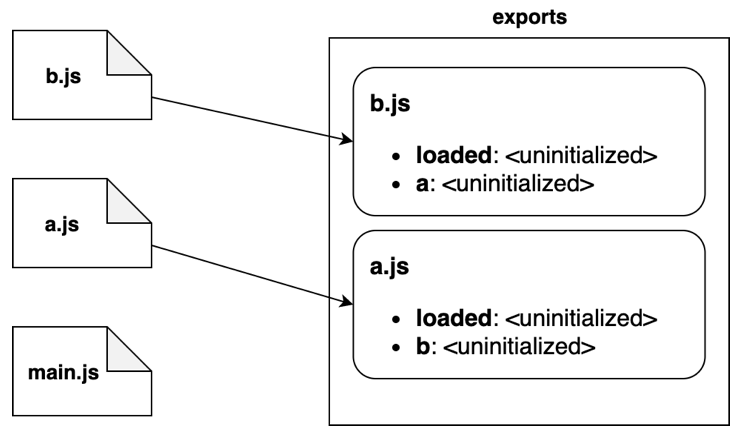
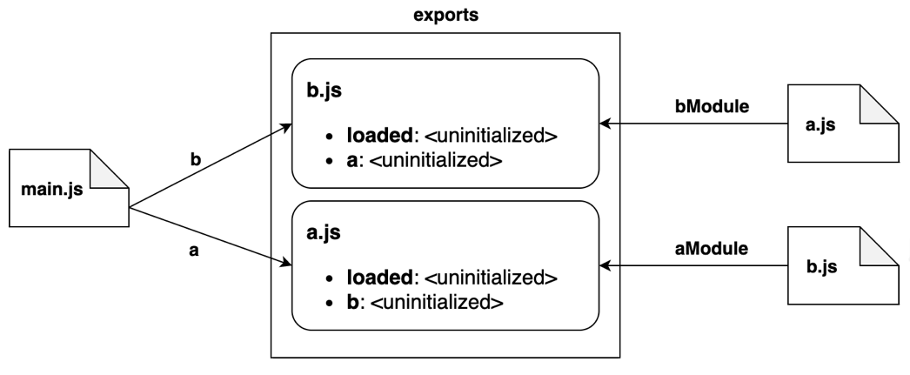
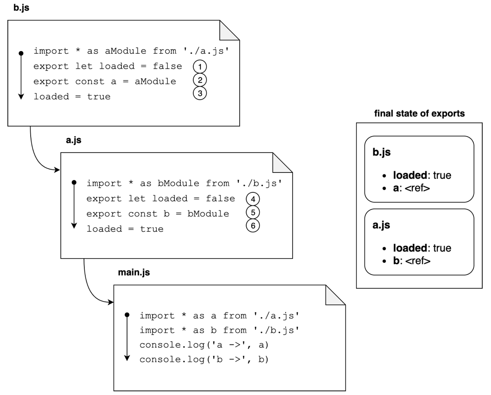

# 循环引用的ECMAScript Module

## 输出结果

```
a-> <ref *1> [Module: null prototype] {
  b: [Module: null prototype] { a: [Circular *1], loaded: true },
  loaded: true
}
b-> <ref *1> [Module: null prototype] {
  a: [Module: null prototype] { b: [Circular *1], loaded: true },
  loaded: true
}
```

## 结论

### 加载顺序不会影响结果

### 获取到的是完整的模块，而不是加载那一刻的状态

### 使用JSON.stringify()会报错，Node.js 内部不允许序列化循环引用

## 过程分析

### 阶段1：解析

从入口（main.js）开始搜索代码。 解释器只寻找导入语句来查找所有必要的模块，并从模块文件中加载源码。 以深度优先的方式探索依赖关系图，每个模块只访问一次。



1. 从main.js，第一个导入语句是a.js.
2. 在a.js中，找到了b.js的导入点。
3. 在b.js中，又有了a.js的导入，但是a.js已经被访问过，这个路径不会再去探索。
4. 此时，探索开始回退：b.js没有其他的导入，所以我们回到了a.js； a.js没有其他的导入语句，所以回到了main.js。 在这里我们发现了另一个指向b.js的导入，但是同样的模块已经被探索过，所以这个路径会被忽略。



总结：探索所有的导入，绘制依赖关系图。
### 阶段2：实例化

在实例化阶段，解释器将从上一阶段获得的树视图从底部走到顶部。 对于每个模块，解释器将首先查找所有的导出属性，并在内存中构建导出名称的映射：



1. 解释器从b.js开始并发现模块导出了loaded和a。
2. 然后，解释器移到了a.js，它导出了loaded和b。
3. 最后，它移到了main.js，它没有导出任何方法。
4. 注意，在这个阶段，导出映射只追踪了导出的名，其关联的值目前被视为未初始化。

完成这些步骤后，解释器将会进行另一次传递，将导出的名称链接到导入它们的模块。



图中的“aModule”和“bModule”标注反了。

1. b.js模块将会链接来自a.js的导出，称为aModule。
2. 反过来，a.js将会链接所有b.js的导出，称为bModule。
3. 最终，main.js 将会导入所有b.js的导出，并命名为b；相似的，它导入所有a.js的导出，称为a。
4. 再一次，注意到所有的值都是未初始化的是很重要的。在这个阶段，我们只将引用链接到值。 这些值在下个阶段结束时可用。

总结：从底到顶，找到所有的导出映射；然后仍然从底到顶，链接导入到导出，这时的值只保留引用。

### 阶段3：评估

最后一步是评估阶段，在这个阶段里，每个文件中的代码最终都已执行。执行次序还是自下而上。通过这个方法，main.js是最后被执行的文件。 这种方式可以保证在开始执行我们主要业务逻辑之前，所有导出的值已经被初始化过。



1. 执行从b.js 开始，第一行初始化了loaded导出为false。
2. 同样的，这里导出的a属性评估过。这次，它将会被评估为一个代表模块a.js的模块对象的引用。
3. loaded属性的值变更为true。这时，我们完成了对模块b.js的导出状态的评估。
4. 现在评估来到了a.js。同样的，我们先把loaded设置为false.
5. 这时，b导出被评估为一个对模块b.js的引用。
6. 最后，loaded属性被改变为true。现在我们也终于评估了a.js的所有导出。

这些步骤完成后，main.js的代码才可以被执行，并且此时，所有导出属性已经被评估完成。 因为导入的模块被追踪为引用，我们能确保所有模块都有其他模块的最新图像，即使是在循环引用中。
